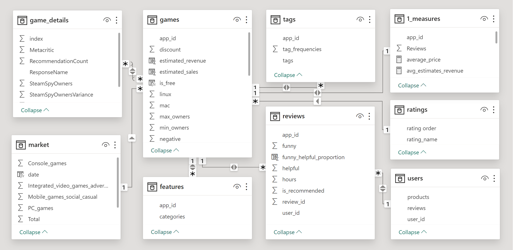
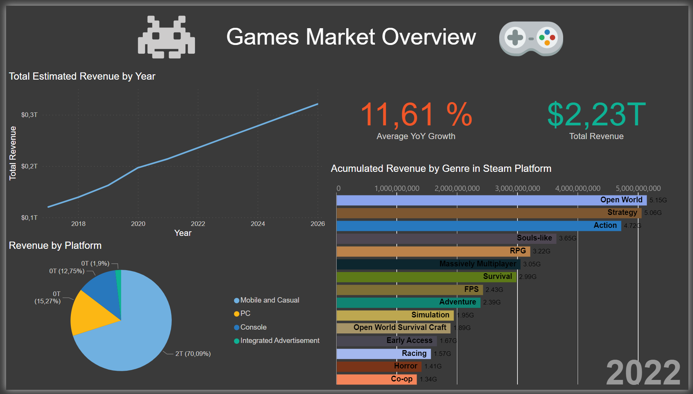
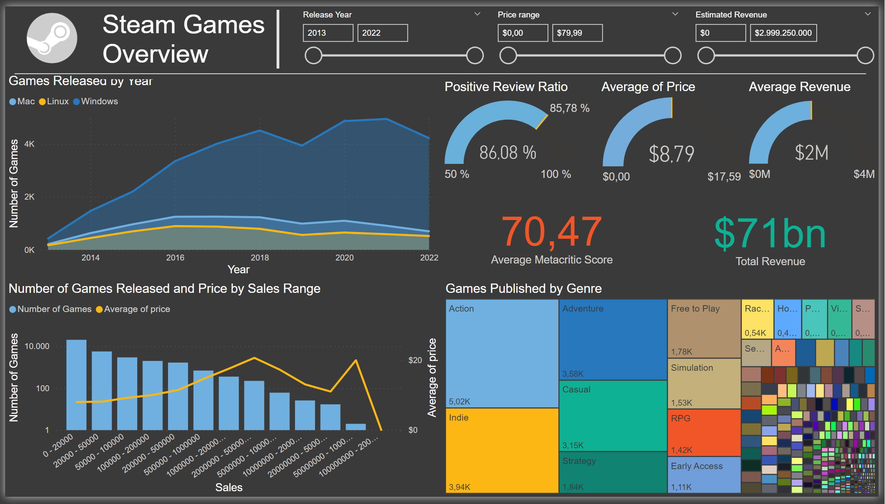
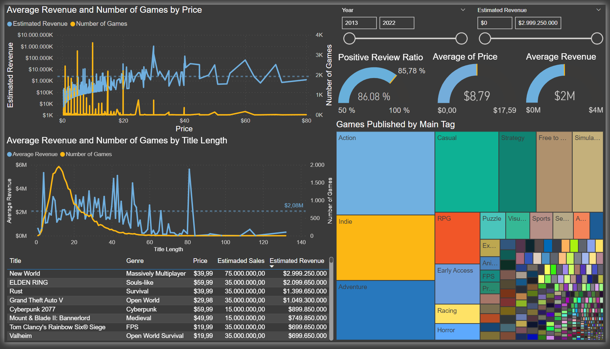
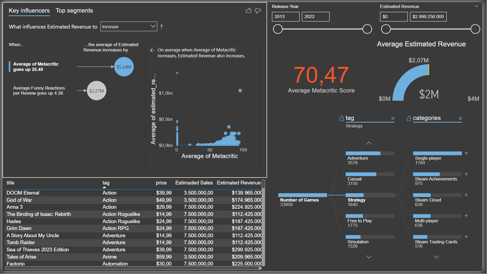
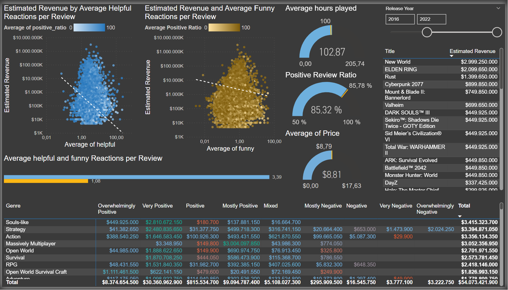

# Steam Platform Market Analysis

Steam Platform is an online platform responsible for over 70% of PC videogame sales. As the main player in this industry and the place choosen my most of the delopment companies to sale their games, an analysis seems in order for those who are interested in creating their own PC videogames.

---

## Data Model

The dataset was obtained from various websites mainly Kaggle.com and loaded to a **Azure SQL Server**. Then it was imported to **Power Bi** with the following logic data model:

## Dashboards

### Market  Overview:

In this dashboard we can observe the **main figures** of the videogames market and their trend towards the future. It also shows steam platform sales evolution by year and genre.

### Steam Games Overview

This dashboard provides a general overview of **Steams Game Market** from 2013 to 2023.

### Financial I

This dashboard tries to gather some insight about how game characteristics like genre, price or title length correlate with the revenue generated by the game.

### Financial II

On this dashboard we analyze the **key influencers** on a game estimated **revenue**.

### Marketing

This dashboard if focused on designing the **best marketing campaing** for each game segment depending on **sentiment factors**.
